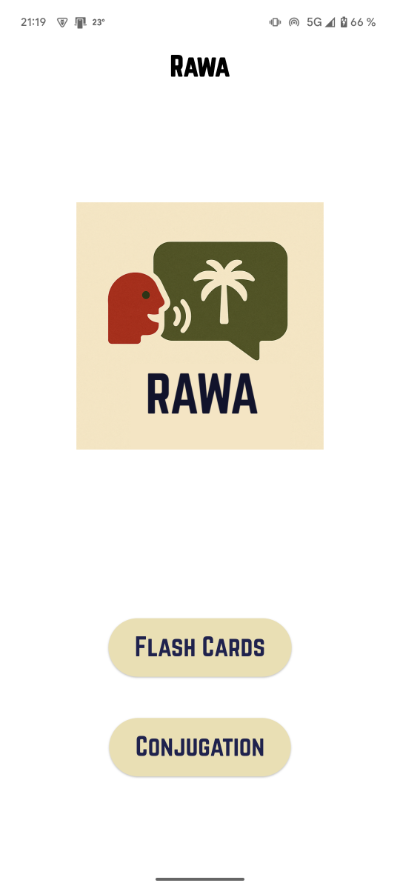
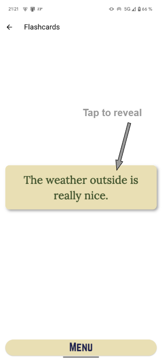
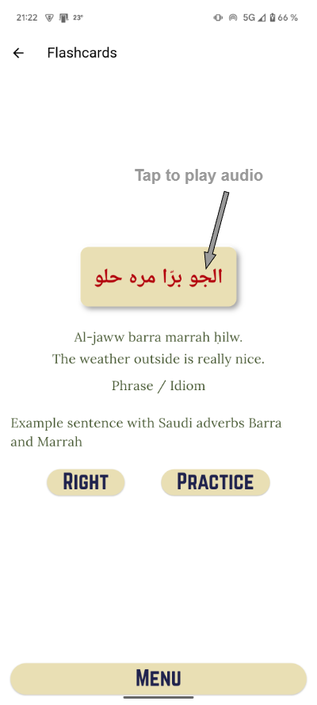
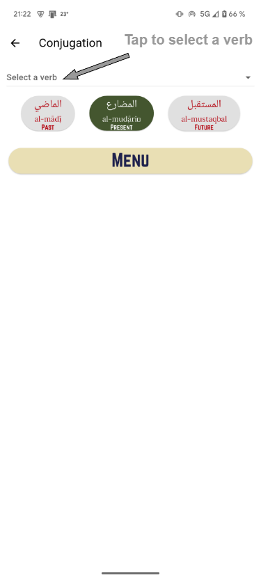
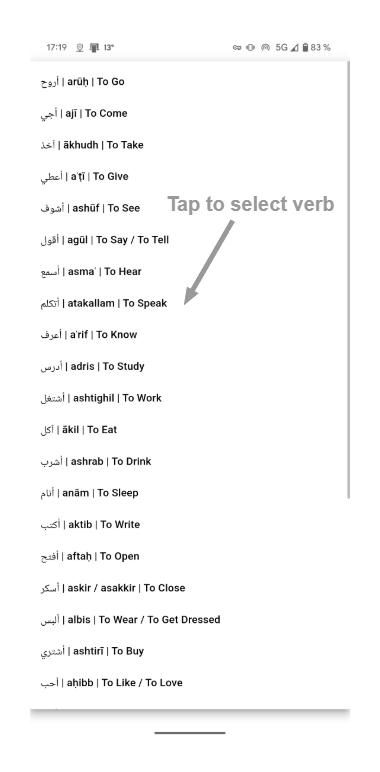
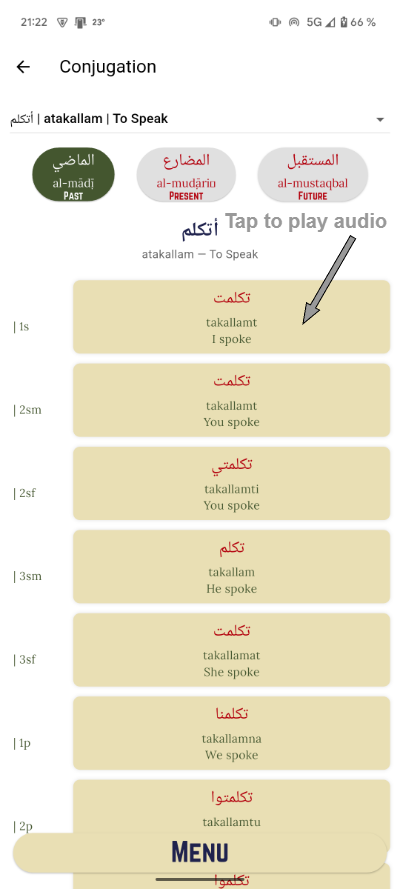

# 🗣️ RAWA

[🇫🇷 Read in English](README.md)

**Une application mobile légère pour acquérir une maîtrise pratique de l’arabe saoudien, grâce à la répétition espacée, des filtres intelligents et une génération de phrases assistée par IA.**

---

## 📱 Présentation

Cette application est destinée :
- 🧠 Aux passionné·e·s de langues
- 🌍 Aux expatrié·e·s vivant en Arabie saoudite
- ✈️ Aux voyageur·euse·s en auto-apprentissage

Elle a pour objectif d’aider les apprenants à **maîtriser l’arabe saoudien parlé**, en combinant **un système de flashcards intelligent**, des **phrases contextualisées** et **un rendu audio proche du natif**.

---

## 🧠 Fonctionnalités Actuelles

- **Système de flashcards** (avec filtres et journalisation intelligente)
- **Tableaux de conjugaison** pour les verbes essentiels
- **Lecture audio** pour chaque mot ou phrase
- **Base de données locale SQLite** avec vocabulaire enrichi de métadonnées
- ⚙**Filtres disponibles :**
  - Type : *mot*, *phrase*, ou *les deux*
  - Pour les mots : *catégorie*, *thème* (si nom)
  - Pour les phrases : *structure*, *fonction*, *utilité*, *thème*, *ton*

> ✨ L’application fonctionne entièrement en local — aucun compte requis, pas de serveur, pas de connexion internet.

---

## 🔮 Fonctionnalités à Venir

- **Génération de phrases quotidiennes** assistée par LLM
- Ciblage intelligent des structures grammaticales, tons et thématiques
- Personnalisation avancée via historique d’apprentissage
- Statistiques de progression et suivi des sessions

---

## 🛠️ Stack Technique

- **Framework :** Flutter (Dart)
- **Base de données :** SQLite locale
- **Audio :** fichiers `.mp3` + synthèse vocale via **ElevenLabs**
- **IA :** utilisation d’un LLM (GPT) pour la génération de phrases *(à venir)*
- **Plateformes :** Android (APK uniquement) — non encore disponible sur le Play Store
- **Offline-first :** aucune dépendance serveur
- **Open-source :** sous licence MIT

---

## 🖼️ Captures d'Écran

- 📲 **Écran Flashcard**  
&nbsp;

  

- 🧮 Référence de conjugaison  
  
  

- Générateur de phrases *(bientôt disponible)*
- Interface de sélection des filtres *(bientôt disponible)*

> Toutes les captures d’écran sont disponibles dans le dossier `/assets/`.

---

## 🚀 Installation (Android uniquement)

### 🔧 Prérequis
- Un smartphone Android ou un émulateur
- (Optionnel) Android Studio pour compiler depuis le code source

### 📦 Installation via APK
1. Téléchargez le fichier `.apk` le plus récent depuis l’onglet [Releases](https://github.com/HenriSandifer/Saudi_Arabic_Flash_Cards_Flutter/releases/latest)
2. Autorisez l’installation d’applications issues de sources inconnues
3. Ouvrez le fichier APK pour installer l’application

---

## 📚 Mode d’Emploi *(fonctionnalités complètes à venir)*

1. Choisissez entre **Mots** ou **Phrases**
2. Appliquez les filtres souhaités (catégorie, ton, structure, etc.)
3. Appuyez pour révéler la réponse, et enregistrez votre réponse ("Right" / "Practice")
4. Cliquez sur la case en arabe pour entendre l’audio natif
5. *(Bientôt)* Générez une phrase quotidienne adaptée à votre progression

---

## 🌐 Localisation

L’application cible actuellement le dialecte **saoudien**, basé sur l’usage courant à **Madinah** et **AlUla**. Le MSA (arabe standard) et d’autres dialectes pourraient être ajoutés par la suite.

---

## 👨‍💻 À propos du Développeur

Créée par **Henri Sandifer**, data scientist et linguiste polyglotte, passionné par l’apprentissage intuitif des langues et la maîtrise pratique des dialectes rares ou sous-représentés.

> 🌍 Parle couramment anglais, français, italien — niveau intermédiaire en arabe, espagnol, japonais, allemand

---

## 📄 Licence

Ce projet est distribué sous licence MIT. Voir le fichier [LICENSE.md](LICENSE.md) pour plus d’informations.

---

## 🌟 Contributions / Retours

Vous êtes apprenant·e, linguiste ou développeur·euse intéressé·e par les outils dédiés à l’arabe saoudien ?  
→ N’hésitez pas à forker, ouvrir une issue ou proposer des idées d’évolution !
