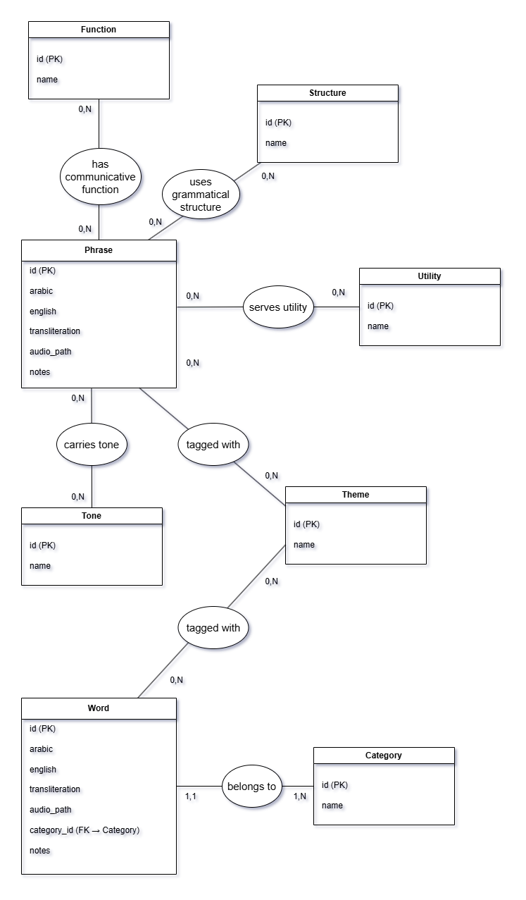
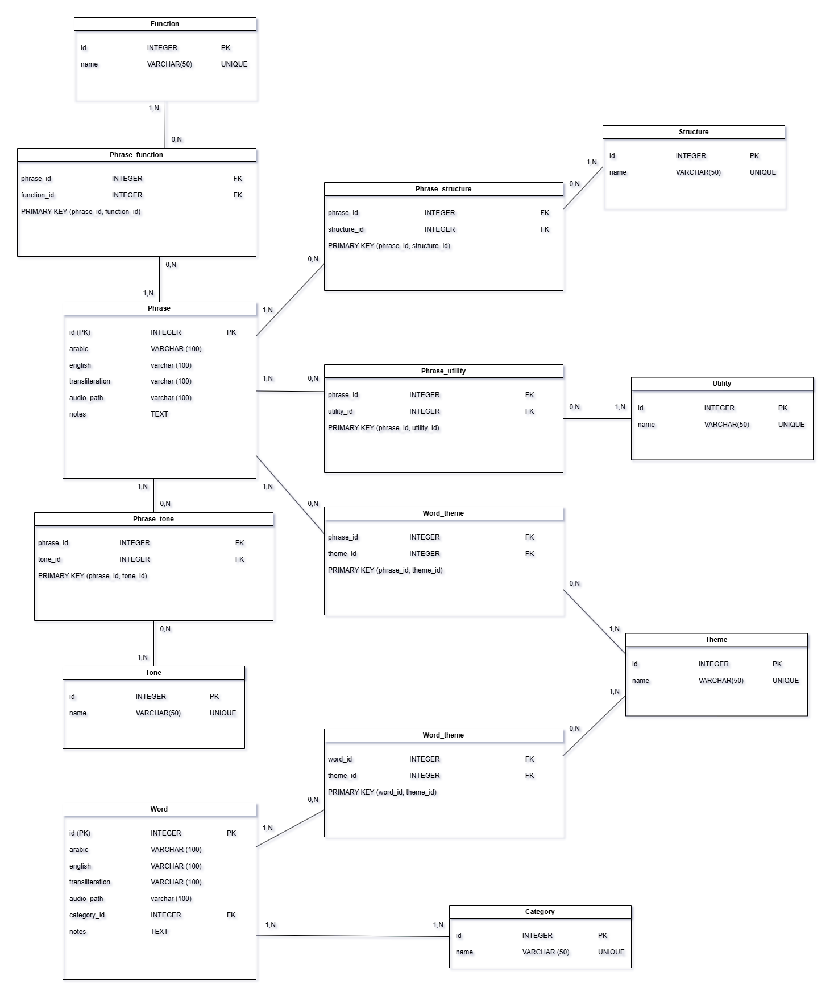
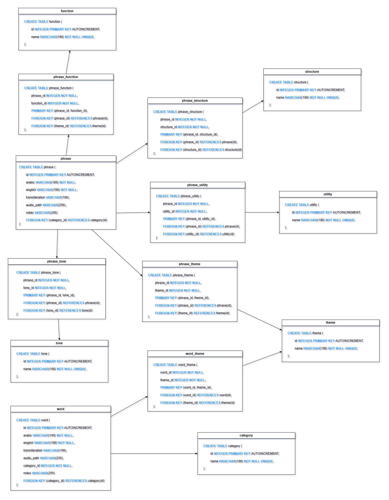
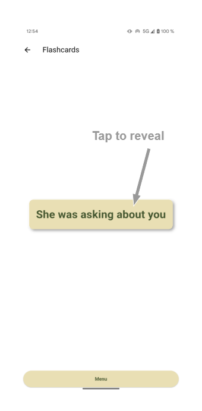
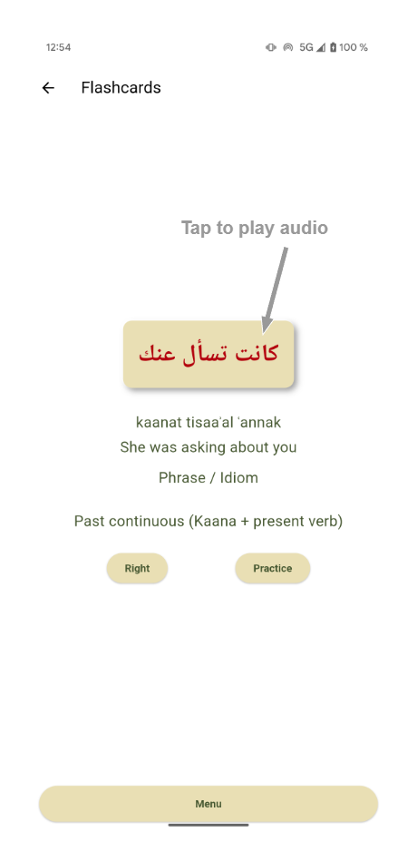
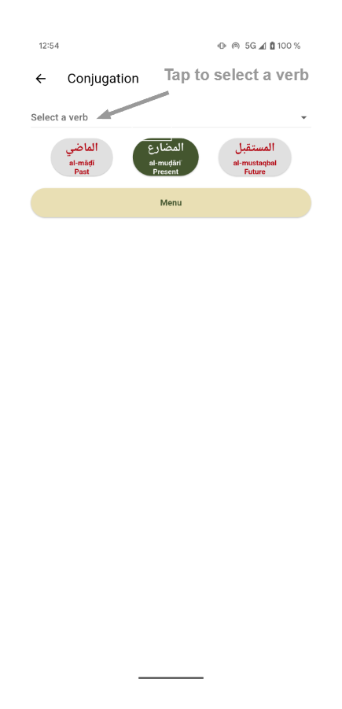
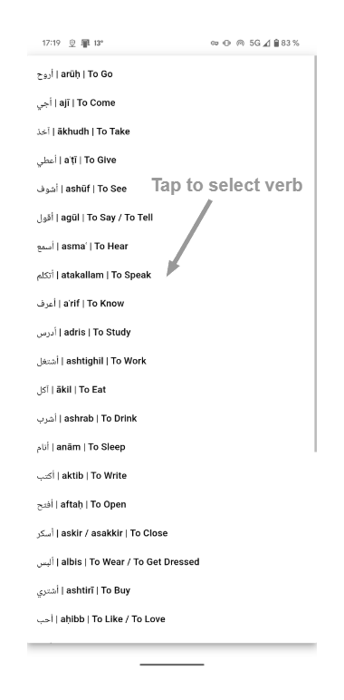
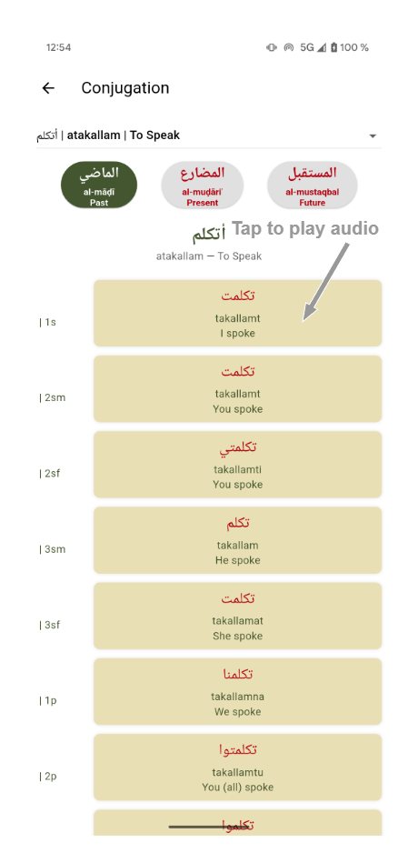

# 🗣️ Saudi Arabic Flashcard App

[🇫🇷 Lire en français](README.fr.md)

**A lightweight mobile app to build practical fluency in Saudi Arabic, through spaced repetition, smart filters, and AI-powered sentence generation.**

---

## 📱 Overview

This app is designed for:
- 🧠 Language enthusiasts
- 🌍 Expats living in Saudi Arabia
- ✈️ Self-study travelers preparing for real-world situations

Its goal is to help learners **acquire spoken Saudi Arabic more effectively**, by combining **intelligent flashcard filters**, **context-rich sentences**, and **native-like audio**.

---

## 🧠 Current Features

- 🎴 **Flashcard system** (with filters and smart logging)
- 📘 **Conjugation tables** for essential verbs
- 🎧 **Audio playback** for every word or sentence
- 📁 **Local SQLite database** of vocabulary and metadata
- ⚙️ **Filter flashcards by:**
  - Vocab type: *word*, *phrase*, or *both*
  - Word filters: *category*, *theme* (if noun)
  - Phrase filters: *structure*, *function*, *utility*, *theme*, *tone*

> ✨ Everything is offline and works locally — no signup, no server, no internet required.

---

## 🔮 Upcoming Features

- ✍️ **Daily sentence generation**, powered by LLMs
- 🎯 Smart targeting of grammar points, tones, and themes
- 🗂️ Enhanced flashcard personalization via learning history
- 📊 Performance metrics and review streaks

---

## 🛠️ Technical Summary

- **Framework:** Flutter (Dart)
- **Database:** Local **SQLite**
- **Audio:** `.mp3` files + **ElevenLabs** text-to-speech
- **AI:** Uses an LLM (GPT) for phrase generation *(planned)*
- **Platforms:** Android (APK) only — not yet on Google Play
- **Offline-first:** No internet or server dependency
- **Open-source:** Code available under MIT License

---

## 🗃️ Data Model & Architecture

The app uses a robust relational schema to support complex filters and personalized tracking. Tables include:

- `vocab`, `daily_sentences`
- `grammar`, `conjugation`, `user_logs`
- Linking tables: `vocab_theme`, `vocab_type`, `phrase_structure`, etc.

### 📊 Merise Diagrams:
- **MCD (Conceptual Data Model)**
&nbsp;

- **MLD (Logical Data Model)**
&nbsp;

- **MPD (Physical SQL Tables)**
&nbsp;

 

> ☑️ See `/assets/` for full-resolution diagrams.

---

## 🖼️ Screenshots

- 📲 **Flashcard Screen**
&nbsp;

- 🧮 **Conjugation Reference**
&nbsp;

- 🧠 **Sentence Generator** *(coming soon)*
&nbsp;

- 📂 **Filter Selection Panel** *(coming soon)*
&nbsp;

> 👇 All screenshots available in the `/assets/` folder.

---

## 🚀 Installation (Android only)

### 🔧 Prerequisites
- Android phone or emulator
- (Optional) Android Studio if building locally from source

### 📦 To install from APK
1. Download the latest `.apk` file from the [Releases](https://github.com/HenriSandifer/Saudi_Arabic_Flash_Cards_Flutter/releases/latest)
2. Allow app installation from unknown sources on your device
3. Open the APK and install

---

## 📚 How to Use - full feature deployment to come

1. Choose between **Words** or **Phrases**
2. Apply smart filters (category, tone, structure, etc.)
3. Tap to reveal, log your result ("Right" / "Practice")
4. Click the arabic script box for native audio
5. (Soon) Generate a daily phrase tailored to your goals

---

## 🌐 Localization

The app currently supports **Saudi dialect only**, based on usage in and around **Madinah and AlUla**. Modern Standard Arabic and other dialects may be added in the future.

---

## 👨‍💻 About the Developer

Created by **Henri Sandifer**, a multilingual data scientist and linguist passionate about intuitive language learning and practical fluency in underrepresented dialects.

> 🌍 Fluent in English, French, Italian — Intermediate in Arabic, Spanish, Japanese, German

---

## 📄 License

This project is licensed under the MIT License. See the [LICENSE.md](LICENSE.md) file for details.

---

## 🌟 Contributing / Feedback

If you're a learner, linguist, or developer interested in improving Saudi Arabic tools, feel free to fork, open an issue, or suggest new features!
